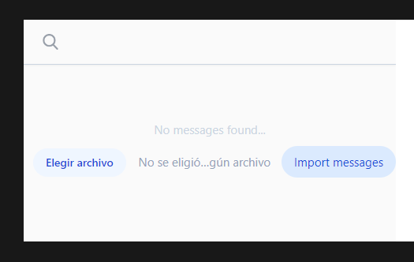
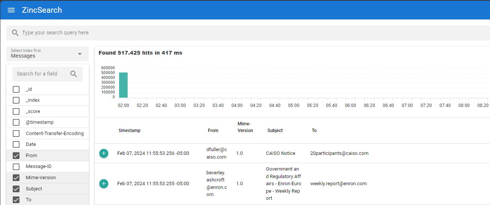
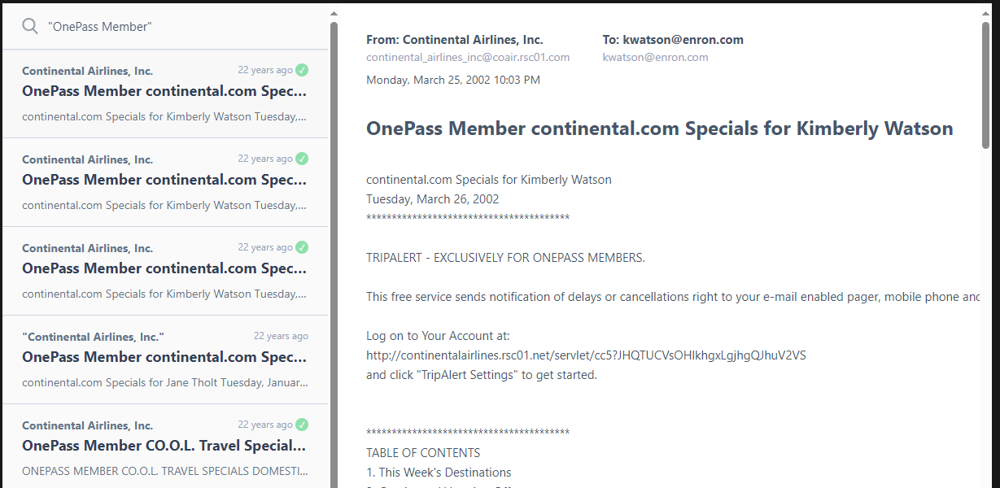

# Email Indexer
This repository contains code of an email indexer endpoint that using a files email database indexes the information 
to ZincSearch and an interface to search the messages.
## How to run
1. Create run an image of ZincSearch using the following command (replace /full/path/of/data)
```shell
    docker run -v /full/path/of/data:/data -e ZINC_DATA_PATH="/data" -p 4080:4080 \
    -e ZINC_FIRST_ADMIN_USER=admin -e ZINC_FIRST_ADMIN_PASSWORD=Complexpass#123 \
    --name zincsearch public.ecr.aws/zinclabs/zincsearch:latest
```
2. run command `docker compose up` and go to http://127.0.0.1:5173 url
3. Import the email database file in the file input (Currently supports only .tar files, t.tar.tgz is an example) \
 
4. In local [ZyncSearch](http://localhost:4080/ui/search)  should be loaded the database 
5. Then, messages can be searched in the search input
